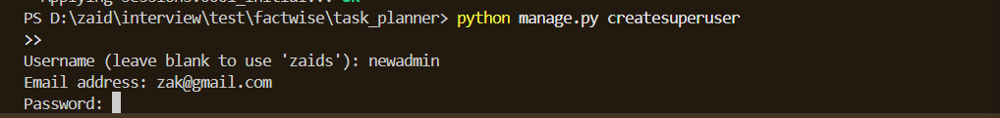

## Table of Content

1. General inoformation
2. Requirements
3. Installation
4. Usage
5. API Endpoints
6. Project Structure
7. Admin Actions


## 1. General information

Task Planner is a web-based application built using Django that helps teams manage and track tasks, boards, and user assignments. It allows for task assignment, team management, board organization, and more. The project utilizes a REST API for handling data operations.

### Features
- Create, update, and manage tasks.
- Create and assign users to teams.
- Manage boards and assign tasks to them.
- REST API endpoints for user, team, and board management.
- Actions in Django admin to create and export tasks, teams, and users.


### 2. Requirements

- Python 3.12
- Django 5.2
- Requests 2.32.3
- djangorestframework

## 3. Installation

Follow the steps below to get your development environment set up:
### Step-by-Step Installation

1. **Clone the repository**

   **Clone this repository to your local machine:**

   ```
   bash
   git clone https://github.com/yourusername/task-planner.git
   cd task-planner
   ```
   ```
   Install the dependencies listed in requirements.txt:
   pip install -r requirements.txt
    ```
   **Run migrations:**
   ```
   python manage.py makemigrations

   ```
   ```
   python manage.py migrate

   ```
**Create a superuser, make sure you are inside task planner folder**

    python manage.py createsuperuser
#### Screenshot


**Start the server:**
    python manage.py runserver

**Visit http://127.0.0.1:8000/ in your browser to access the application.**

## 4. Usage

Once the application is running, you can interact with it through the **Django Admin Panel** or the **API**.

### Django Admin Panel

- **URL:** [http://127.0.0.1:8000/admin/](http://127.0.0.1:8000/admin/)
- **Access:** Login using the superuser credentials you created during setup.

#### Screenshot


# 🧾 Task Planner API Documentation

This API allows for managing **Users**, **Teams**, **Boards**, and **Tasks** to support collaborative project management.

---

## 5. API Endpoints

The following REST API endpoints are available in the Task Planner system.

---

### 👤 User Endpoints

| Method | URL              | Description            | Request Payload                                             |
|--------|-------------------|------------------------|-------------------------------------------------------------|
| POST   | `api/user/create/`   | Create a new user       | `{ "name": "johndoe", "display_name": "John Doe" }`         |
| GET    | `api/user/list/`     | List all users          | _No body required_                                          |
| POST   | `api/user/describe/` | Describe a user         | `{ "id": "user-id" }`                                       |
| PUT    | `api/user/update/`   | Update user display name| `{ "id": "user-id", "user": { "display_name": "New Name" } }`|
| POST   | `api/user/teams/`    | List user’s teams       | `{ "id": "user-id" }`                                       |

---

### 👥 Team Endpoints

| Method | URL                | Description               | Request Payload                                                                 |
|--------|---------------------|----------------------------|---------------------------------------------------------------------------------|
| POST   | `api/team/create/`     | Create a new team          | `{ "name": "Team Alpha", "description": "Team description", "admin": "user-id" }` |
| GET    | `api/team/list/`       | List all teams            | _No body required_                                                              |
| POST   | `api/team/describe/`   | Describe a team           | `{ "id": "team-id" }`                                                          |
| PUT    | `api/team/update/`     | Update team details       | `{ "id": "team-id", "team": { "name": "New Name", "description": "New Desc", "admin": "new-admin-id" } }` |
| POST   | `api/team/add-users/`  | Add users to a team       | `{ "id": "team-id", "users": ["user1-id", "user2-id"] }`                       |
| POST   | `api/team/remove-users/`| Remove users from a team  | `{ "id": "team-id", "users": ["user1-id"] }`                                    |

---

### 📋 Board Endpoints

| Method | URL               | Description             | Request Payload                                                                     |
|--------|---------------------|--------------------------|-------------------------------------------------------------------------------------|
| POST   | `api/board/create/`    | Create a new board       | `{ "name": "Sprint Board", "description": "First Sprint", "team_id": "team-id" }`    |
| POST   | `api/board/close/`     | Close a board           | `{ "id": "board-id" }`                                                             |
| POST   | `api/board/list/`      | List boards for a team   | `{ "id": "team-id" }`                                                              |
| POST   | `api/board/export/`    | Export a board           | `{ "id": "board-id" }`                                                             |

---

### ✅ Task Endpoints

| Method | URL                  | Description          | Request Payload                                                        |
|--------|-----------------------|--------------------- |-----------------------------------------------------------------------|
| POST   | `api/task/add/`          | Add a new task       | `{ "title": "Implement API", "description": "Setup user endpoints", "board_id": "board-id", "user_id": "user-id" }` |
| PUT    | `api/task/update-status/`| Update task status   | `{ "id": "task-id", "status": "COMPLETE" }`                            |

---

## 🛠 Example Usage

### Create User

```
    http
    POST api/user/create/
    Content-Type: application/json

    {
    "name": "johndoe",
    "display_name": "John Doe"
    }
```
#### Screenshot of User Creation

#### Screenshot of Team Creation


## 6 Project Structure

The following is the directory structure of the `task_planner` Django project:

```
    task_planner/
    ├── manage.py
    ├── requirements.txt
    ├── Readme.md
    │
    ├── core/
    │   ├── __init__.py
    │   ├── admin.py
    │   ├── apps.py
    │   ├── models.py
    │   ├── serializers.py
    │   ├── tests.py
    │   ├── urls.py
    │   ├── views.py
    │   └── migrations/
    │       └── __init__.py
    │
    └── task_planner/
        ├── __init__.py
        ├── asgi.py
        ├── settings.py
        ├── urls.py
        └── wsgi.py
```


## 7. Admin Actions

The following custom admin actions are available:

- **Create Users**: Allows you to create selected users.
- **Update Users**: Update selected users.
- **Create Teams**: Allows you to create teamm.
- **Export Boards**: Allows you to export board details to a 'out' file.

#### Screenshot of User Creation In Admin Panel

successfully added user!


#### Screenshot of Team Creation In Admin Panel

successfully added team!


